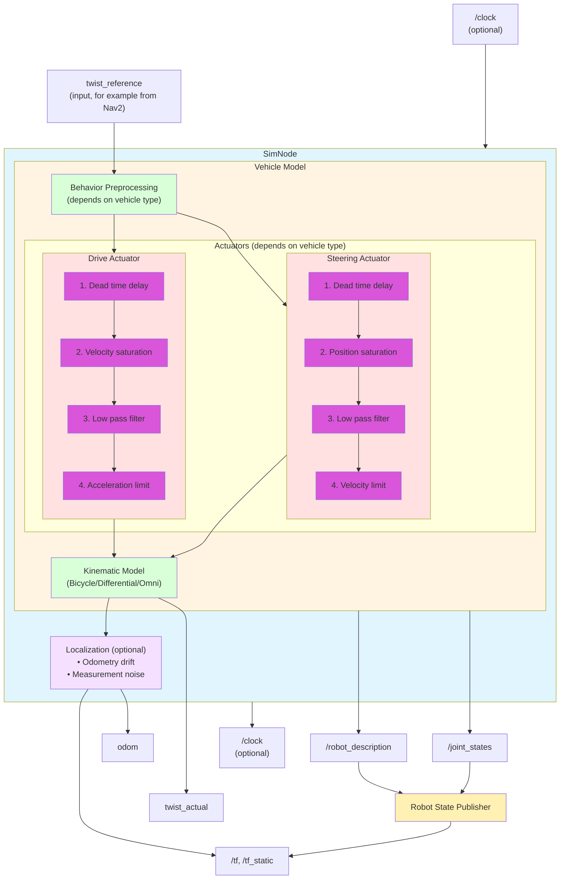

# Vehicle Dynamics Simulator

An **easy to interface and configure** as well as **lightweight**
ROS 2 vehicle dynamics simulator
focused on **realistic actuator dynamics** and kinematics.
Simulates vehicle motion with configurable delay, filtering,
and acceleration/velocity limits
to accurately represent real world vehicle behavior.

The main intended **use case** is as
**development tool for trajectory following controllers**,
such as those (RPP, MPPI etc.) part of the Nav2 stack,
both in manual development and in automated testing pipelines.

Key README contents:
- [Quick Start](#quick-start)
- [System Architecture](#system-architecture)
- [Core Components](#core-components)
- [Configuration](#configuration-reference)

## Features

- **Single-yaml config file**:
  One ROS param file with doubles and bools to configure the vehicle.
  No URDF or other additional files required.
- **Three vehicle models**:
  **Bicycle** (includes Ackermann), **differential** drive
  and **omni**directional.
  Many variations possible (see [Configuration](#configuration-reference)).
- **Realistic actuator dynamics**:
  Dead time delays, first order filtering, velocity/acceleration limits.
- **Realistic localization noise**:
  Odometry drift and map pose measurement noise for realistic sensor
  and fusio modelling, including the intermediate odom frame.
- **Nav2 integration**:
  Full compatibility with Nav2 navigation stack
  (publishes all the required topics + [example setup](src/nav2_example) provided).
- **High frequency simulation**:
  1000 Hz internal simulation (publish rate configurable separately).
- **RViz visualization**:
  Real time 3D vehicle visualization with joint states
  (URDF generated exclusively from ROS parameters).
- **Flexible clock modes**:
  Can follow wall clock, external simulation time (`/clock` topic)
  or act as time source.

**Note**:
This simulator focuses on vehicle kinematics and dynamics
(motion, actuators, localization).
It does not simulate collisions, terrain, sensors (lidar, cameras),
or other environmental aspects typically found
in full physics simulators like Gazebo.

## Quick Start

### Prerequisites
- Docker and Docker Compose
- Git

### Build and Run

```bash
# Clone repository
git clone https://github.com/abaeyens/vehicle_dynamics_sim.git
cd vehicle_dynamics_sim
git submodule update --init --recursive

# Set up environment and build Docker image
./create_dot_env
docker compose build --pull

# Start container
docker compose run --rm --name sim app bash

# Inside container: build ROS 2 workspace
colcon build
source install/setup.bash

# Run simulator (default: bicycle model)
ros2 run vehicle_dynamics_sim sim_node
```

In another terminal:
```bash
# Enter running container
docker exec -it sim bash

# Send velocity commands
ros2 run vehicle_dynamics_sim publish_some_velocities
```

If desired, run unit and integration tests and print the results:
```bash
colcon test --packages-select vehicle_dynamics_sim
xunit-viewer -r build/vehicle_dynamics_sim/test_results -c
```
All tests run sequentially,
allowing supervision of the vehicle movements in RViz and PlotJuggler.
See also [src/vehicle_dynamics_sim/test/README.md](src/vehicle_dynamics_sim/test/README.md).

## Visualization

### RViz
View the vehicle in 3D with coordinate frames and motion:

```bash
# In another terminal in the container
rviz2 -d layout.rviz
```

The RViz layout shows:
- Vehicle model with realistic Ackermann steering geometry
- TF tree (map → odom → base_link)
- Odometry path visualization

### PlotJuggler
Analyze vehicle dynamics data in real-time:

```bash
# In another terminal in the container
ros2 run plotjuggler plotjuggler --layout plotjuggler_layout.xml
```

Monitors:
- Commanded vs actual velocities
- Steering angles
- Position and heading over time
- Actuator responses

## Basic Usage Examples

### Run with Different Vehicle Models

```bash
# Bicycle (includes Ackermann steering) - default
ros2 run vehicle_dynamics_sim sim_node

# Differential drive
ros2 run vehicle_dynamics_sim sim_node --ros-args \
  -p model:=differential

# Custom parameters from file
ros2 run vehicle_dynamics_sim sim_node --ros-args \
  --params-file src/vehicle_dynamics_sim/params/all_vehicles.yaml
```

### Send Velocity Commands

```bash
# Using command line (simple but limited)
ros2 topic pub /twist_reference geometry_msgs/msg/Twist \
  "{linear: {x: 1.0}, angular: {z: 0.5}}"

# Using the provided script (generates smooth motion)
ros2 run vehicle_dynamics_sim publish_some_velocities
```

### Run with Nav2

Launch the full Nav2 navigation stack with the simulator:

```bash
# Terminal 1: Start simulator
ros2 run vehicle_dynamics_sim sim_node --ros-args \
  --params-file src/vehicle_dynamics_sim/params/all_vehicles.yaml

# Terminal 2: Launch Nav2
ros2 launch nav2_example navigation.launch.py \
  params_file:=src/nav2_example/params/nav2.yaml

# Terminal 3: Visualize in RViz
rviz2 -d layout.rviz
```

Then use RViz's "2D Nav Goal" tool to send navigation goals.

## System Architecture


The current dynamics puts the inertia in the actuator objects;
for some vehicles, like the omnidirectional one, this is not ideal.
Likely we'll therefore deviate from that in the future.

## Core Components

## SimNode (`sim.h`, `sim.cpp`)
Main ROS 2 node that orchestrates the simulation.

**Responsibilities:**
- Time management (simulation clock or following external clock)
- Command input handling (twist messages)
- Vehicle state propagation
- Output publishing (TF, odometry, joint states, URDF)
- Localization simulation coordination

**Key Topics:**
- **Subscribed:**
  - `twist_reference` (geometry_msgs/Twist) - Velocity commands
  - `twist_stamped_reference` (geometry_msgs/TwistStamped) - Timestamped velocity commands
  
  > **Note:** Both stamped and non-stamped are provided because Nav2 switched from non-stamped to stamped in ROS 2 Kilted, and we want to support both.
  Adjust the remap in [sim.launch.xml](src/vehicle_dynamics_sim/launch/sim.launch.xml)
  as required.

- **Published:**
  - `/tf` (tf2_msgs/TFMessage) - Transform tree
  - `/tf_static` (tf2_msgs/TFMessage) - Static transforms
  - `/joint_states` (sensor_msgs/JointState) - Joint positions for visualization
  - `/robot_description` (std_msgs/String) - URDF model
  - `twist_actual` (geometry_msgs/TwistStamped) - Actual velocity after dynamics
  - `odom` (nav_msgs/Odometry) - Odometry messages (pose + actual velocity)
  - `clock` (builtin_interfaces/Time) - Optional simulation time

## Vehicle models (`vehicles.h`, `vehicles.cpp`)

### Base Class: Vehicle
- Manages pose (position, heading)
- Publishes twist and joint states
- Provides robot description (URDF)

### Bicycle Vehicle (Ackermann Steering)

Implements Ackermann steering geometry for car-like vehicles.

**Kinematics:**
```
v_angular = v_forward * tan(steering_angle) / wheelbase
```

**Key Parameters:**
- `wheel_base`: Distance between front and rear axles [m]
- `drive_on_steered_wheel`: Front wheel drive (true) or rear wheel drive (false)
- `track_steered`: Wheel spacing steered axle [m]
- `vis_track_fixed`: (visualization only) Wheel spacing fixed axle [m]
- `vis_tire_diameter`: (visualization only) Wheel diameter [m]

**Use cases:** Cars, Ackermann robots, outdoor autonomous vehicles

### Differential Vehicle (Tank Steering)

Implements differential drive kinematics with two independently driven wheels.

**Kinematics:**
```
v_forward = (v_left + v_right) / 2
v_angular = (v_right - v_left) / track
```

**Key Parameters:**
- `track`: Distance between left and right wheels [m]
- `vis_tire_diameter`: (visualization only) Wheel diameter [m]

**Behavior:**
Prioritizes rotation by scaling linear velocity if needed to respect actuator limits.

**Use cases:** Indoor mobile robots (e.g. Turtlebot), wheelchairs, tank drive platforms

## Actuator Models (`vehicles.h`, `vehicles.cpp`)

### DriveActuator - Models velocity-controlled actuators (drive motors)

**Dynamic sequence:**
1. Dead time delay
2. Velocity saturation (±max_velocity)
3. First order low pass filter (time_constant)
4. Acceleration limiting (±max_acceleration)

**Parameters:**
- `dead_time`: Transport delay [s]
- `time_constant`: Filter time constant [s]
- `max_velocity`: Velocity limit [m/s]
- `max_acceleration`: Acceleration limit [m/s²]

### SteeringActuator - Models position-controlled actuators (steering mechanisms)

**Dynamic sequence:**
1. Dead time delay
2. Position saturation (±max_position)
3. First order low pass filter with angle wrapping
4. Angular velocity limiting

**Parameters:**
- `dead_time`: Transport delay [s]
- `time_constant`: Filter time constant [s]
- `max_position`: Steering angle limit [rad] (0 = unlimited)
- `max_velocity`: Angular velocity limit [rad/s]

### DeadTimeDelay - Pure time delay model using queue-based history

Simulates delays from:
- Hydraulic systems
- Network latency
- Signal processing chains

Used in both DriveActuator and SteeringActuator.

## Other components
### Localization (`localization.h`, `localization.cpp`)

Simulates realistic localization with two error sources:

**1. Odometry Drift (Random Walk)**
- Accumulates with distance traveled
- Represents wheel slip, encoder errors, IMU drift
- Parameters: `odom_walk_velocity_translation`, `odom_walk_velocity_rotation` [m²/m, rad²/m]

**2. Map Measurement Noise (Sampling)**
- Time-correlated noise
- Represents GPS, SLAM, vision-based localization
- Parameters: `map_sample_noise_translation`, `map_sample_noise_rotation` [m²/s, rad²/s]

**Output:**
- Smooth but drifting odometry (odom → base_link)
- Noisy but bounded map corrections (map → odom)

**Note:** All noise parameters are variances (σ²), not standard deviations.

### URDF Generation (`urdf.h`, `urdf.cpp`)

Programmatic URDF generation for vehicle visualization.

**Features:**
- Dynamic robot description based on parameters
- Ackermann steering joints for bicycle vehicles
- Cylindrical wheels with correct orientation
- Compatible with robot_state_publisher and RViz

### Extension
Please see [extending_the_simulator.md](extending_the_simulator.md).

## Configuration Reference

Complete parameter documentation.
See [src/vehicle_dynamics_sim/params/all_vehicles.yaml](
  src/vehicle_dynamics_sim/params/all_vehicles.yaml) for example values.

> **Note:**
Parameters prefixed with `vis_` only affect visualization.

### Global Parameters

Parameters at `sim_node` namespace level:

| Parameter | Type | Default | Description |
|-----------|------|---------|-------------|
| `step_rate` | double | 1000.0 | Internal simulation frequency [Hz] |
| `pub_rate` | double | 50.0 | Output publishing frequency [Hz] |
| `twist_reference_max_oldness` | double | 1.0 | Max age of commands before zeroing them out [s] |
| `be_reference_clock` | bool | false | Publish clock messages (sim time source) |
| `simulate_localization` | bool | false | Enable localization error simulation |
| `model` | string | "bicycle" | Vehicle type ("bicycle", "differential", "omni") |

### Vehicle Parameters

#### Common to all vehicles
| Parameter | Type | Description |
|-----------|------|-------------|
| `base_link_offset` | double | Distance from the fixed_axle to the base_link frame, measured along positive x [m] |

#### Bicycle Model (`model_params.bicycle`)

| Parameter | Type | Description |
|-----------|------|-------------|
| `wheel_base` | double | Front-to-rear axle distance [m] |
| `drive_on_steered_wheel` | bool | if false, drive on fixed axle, if true drive on the steered wheel(s) |
| `reverse` | bool | if false, the steered axle is in front of the fixed axle, if true the steered axle is behind the fixed axle |
| `vis_track_fixed` | double | Rear wheel spacing [m] (0 = single wheel) |
| `vis_track_steered` | double | Front wheel spacing [m] (0 = single wheel) |
| `vis_tire_diameter` | double | Wheel diameter for visualization [m] |

#### Differential Model (`model_params.differential`)

| Parameter | Type | Description |
|-----------|------|-------------|
| `track` | double | Left-to-right wheel distance [m] |
| `vis_tire_diameter` | double | Wheel diameter, for visualization [m] |

### Actuator Parameters

Common structure for `drive_actuator` and `steering_actuator`:

| Parameter | Type | Description |
|-----------|------|-------------|
| `dead_time` | double | Transport delay [s] |
| `time_constant` | double | Low pass filter time constant [s] |
| `max_velocity` | double | Velocity limit [m/s] or [rad/s] |
| `max_acceleration` | double | Acceleration limit [m/s²] (drive only) |
| `max_position` | double | Position limit [rad] (steering only, 0=unlimited) |

### Localization Parameters (`localization`)

| Parameter | Type | Description |
|-----------|------|-------------|
| `odom_walk_velocity_translation` | double | Drift random walk velocity - translational [m²/m] |
| `odom_walk_velocity_rotation` | double | Drift random walk velocity - rotational [rad²/m] |
| `map_sample_noise_translation` | double | Map -> base_link localization noise density - translational [m²/s] |
| `map_sample_noise_rotation` | double | Map -> base_link localization noise density - rotational [rad²/s] |

**Note:** All noise parameters are variances (σ²), not standard deviations.  
**Example:** `odom_walk_velocity_translation: 0.0025` means σ = 0.05 m per meter traveled.

### Clock Modes

The simulator supports three mutually exclusive clock modes.
Overview (more detailed description after the table):

| Behavior | `use_sim_time` | `be_reference_clock` |
| -------- | -------------- | -------------------- |
| 1. Real time | Behaves close to a real hardware system | false | false |
| 2. Follow External Clock | true | false |
| 3. Reference clock | false | true |

**1. Real Time**  
- Uses system wall-clock time
- Behaves the closest to a real hardware system.

**2. Following External Clock**  
- Simulator reads time from `/clock` topic
- Synchronizes with other simulation tools (Gazebo, etc.)
- Must set `be_reference_clock: false`

**3. Reference Clock**  
- Simulator publishes `/clock` topic
- Other nodes must set `use_sim_time: true`

### Example Configurations
**Note:**
See also [all_vehicles.yaml](src/vehicle_dynamics_sim/params/all_vehicles.yaml)
for a list of (almost all) parameters.

#### Ackermann Car for Navigation

```yaml
sim_node:
  ros__parameters:
    model: bicycle
    model_params:
      bicycle:
        wheel_base: 2.7  # Typical car wheelbase
        drive_on_steered_wheel: false  # Rear-wheel drive
        vis_track_steered: 1.5
        vis_track_fixed: 1.5
        drive_actuator:
          max_velocity: 15.0  # ~54 km/h
          max_acceleration: 3.0
        steering_actuator:
          max_position: 0.61  # ~35 degrees
```

#### Small forklift for Navigation

```yaml
sim_node:
  ros__parameters:
    model: bicycle
    model_params:
      bicycle:
        wheel_base: 2.0
        reverse: true  # steered wheel behind fixed axle
        drive_on_steered_wheel: true
        vis_track_fixed: 1.1
        vis_track_steered: 0.0  # single rear wheel
        drive_actuator:
          max_velocity: 5.0  # 18 km/h
          max_acceleration: 3.0
        steering_actuator:
          max_position: 0.0  # can turn all around
```

#### Indoor Mobile Robot

```yaml
sim_node:
  ros__parameters:
    model: differential
    model_params:
      differential:
        track: 0.5  # Compact robot
        drive_actuators:
          max_velocity: 0.8
          max_acceleration: 1.0
          dead_time: 0.05  # Fast response
```

#### Perfect Localization for Algorithm Testing

```yaml
sim_node:
  ros__parameters:
    simulate_localization: false  # No localization errors
```


## Testing and Validation

### Verify Actuator Dynamics

Use PlotJuggler to check:
- Command vs actual velocity plots show filtering and limits
- Step responses show time constants and delays
- Acceleration profiles respect max_acceleration

### Verify Vehicle Kinematics

**For bicycle model:**
- Zero steering → straight line motion
- Constant steering → circular arc
- Turning radius matches: R = wheelbase / tan(steering_angle)

**For differential model:**
- Equal wheel speeds → straight motion
- Opposite wheel speeds → rotation in place
- Velocity scaling maintains turn rate when saturated

### Verify Localization

Check that:
- Odometry drifts over time (random walk)
- Map→odom transform is noisy but bounded
- Noise increases with: distance traveled (odom) and time (map)

## Troubleshooting

**Vehicle doesn't move:**
- Check twist commands are being published
- Check topic mapping (use `rqt_graph` to visualize node connections)
- Verify `twist_reference_max_oldness` isn't too short
- Check actuator velocity limits aren't too restrictive

**Erratic motion:**
- Check `dead_time` isn't too large
- Verify `max_acceleration` is reasonable
- Look for command saturation in PlotJuggler

**TF errors:**
- Ensure robot_state_publisher node is running
- Check joint names match between URDF and joint_states
- Verify clock settings (`use_sim_time` consistency across all nodes)

**Nav2 integration issues:**
- Confirm odom frame is being published
- Check `base_link_offset` accounts for Nav2's expectations
- Verify cmd_vel topic remapping if needed

**Performance issues:**
- `step_rate`: 1000 Hz provides good accuracy.
  Not worth reducing due to high simulator efficiency (CPU usage is negligible)
- `pub_rate`: 50 Hz is sufficient for Nav2 and visualization.
  Adjust to match your real platform.

## Key Dependencies

- **ROS 2 Jazzy** or later
- **Eigen3** - Linear algebra
- **fmt** - String formatting
- **robot_state_publisher** - TF tree publishing

> **Note:**
Because the `robot_state_publisher` version distributed with Kilted and earlier
does not yet support receiving the robot description over a topic,
we backported that node from rolling to Jazzy
and included it as a submodule in this repo.
When building, this backported package
automatically overlays the system install one.

## API Reference

All header files in [`src/vehicle_dynamics_sim/include/vehicle_dynamics_sim/`](src/vehicle_dynamics_sim/include/vehicle_dynamics_sim/) contain comprehensive docstrings with:
- Physical interpretation
- Mathematical models
- Units and coordinate frames
- Usage examples

### Key Classes

- **SimNode** ([`sim.h`](src/vehicle_dynamics_sim/include/vehicle_dynamics_sim/sim.h)) - Main simulation node
- **Vehicle** ([`vehicles.h`](src/vehicle_dynamics_sim/include/vehicle_dynamics_sim/vehicles.h)) - Base vehicle class
- **BicycleVehicle** ([`vehicles.h`](src/vehicle_dynamics_sim/include/vehicle_dynamics_sim/vehicles.h)) - Ackermann steering implementation
- **DifferentialVehicle** ([`vehicles.h`](src/vehicle_dynamics_sim/include/vehicle_dynamics_sim/vehicles.h)) - Tank steering implementation
- **DriveActuator** ([`vehicles.h`](src/vehicle_dynamics_sim/include/vehicle_dynamics_sim/vehicles.h)) - Velocity actuator model
- **SteeringActuator** ([`vehicles.h`](src/vehicle_dynamics_sim/include/vehicle_dynamics_sim/vehicles.h)) - Position actuator model
- **DeadTimeDelay** ([`vehicles.h`](src/vehicle_dynamics_sim/include/vehicle_dynamics_sim/vehicles.h)) - Time delay model
- **Localization** ([`localization.h`](src/vehicle_dynamics_sim/include/vehicle_dynamics_sim/localization.h)) - Localization simulator

### Utility Functions

- **URDF generation** ([`urdf.h`](src/vehicle_dynamics_sim/include/vehicle_dynamics_sim/urdf.h)) - Programmatic robot description
- **Conversions** ([`conversions.h`](src/vehicle_dynamics_sim/include/vehicle_dynamics_sim/conversions.h)) - Pose/transform utilities
- **Parameter helpers** ([`declare_and_get_parameter.h`](src/vehicle_dynamics_sim/include/vehicle_dynamics_sim/declare_and_get_parameter.h)) - ROS 2 parameter loading

## TODO
- Support running faster than real time.

## Contributing

Contributions are welcome! Please:
1. Fork the repository
2. Create a feature branch
3. Follow the existing code style (= standard ROS 2)
4. Add/update documentation and tests
5. Submit a pull request

Also always welcome: bug reports.
